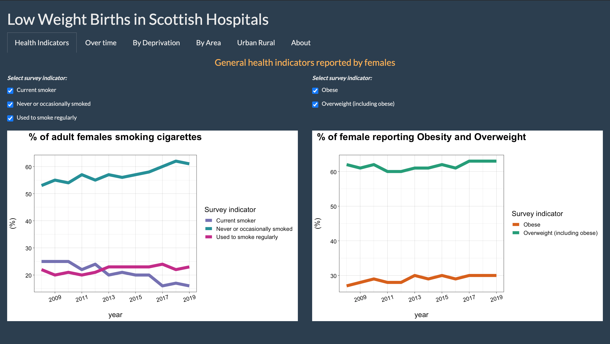
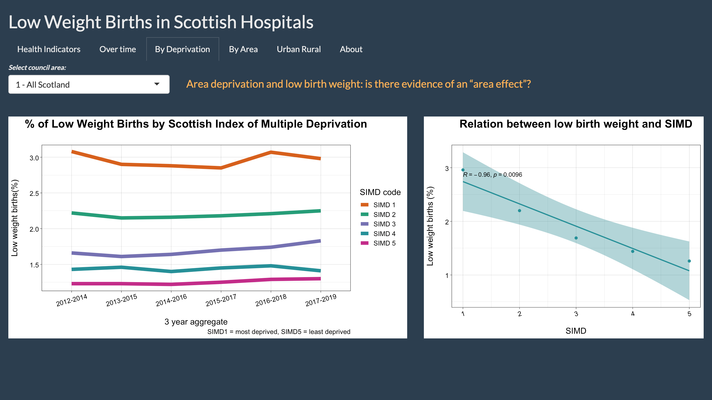
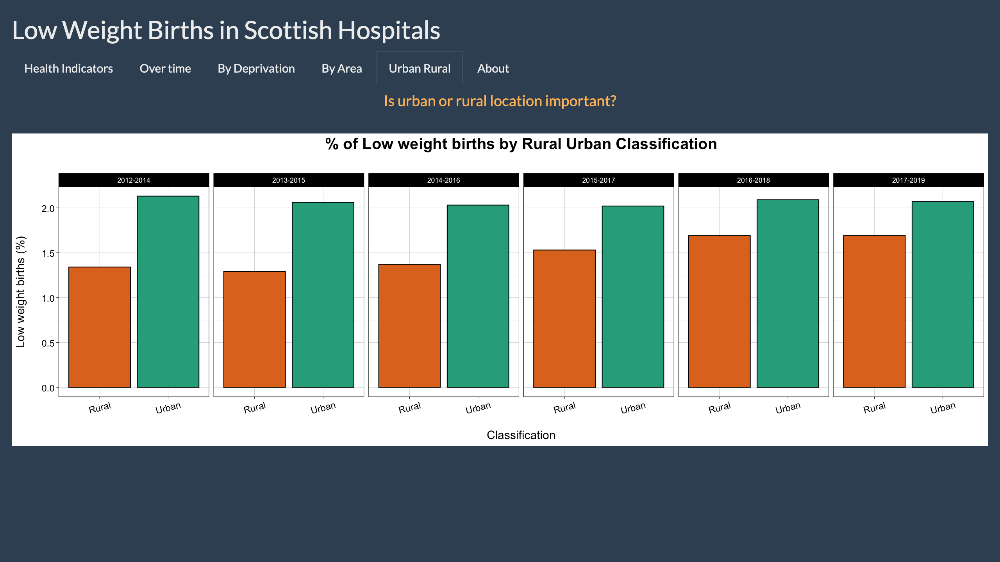

| Title                                 | Date        |
| -----------                           | ----------- |
| Dashboard Project - Health in Scotland| 2021-02-01  |

# Interactive Dashboard Project - Public Health in Scotland

## Overview

This repository showcases a dashboard app created using R studio and Shiny functionality to explore health data in Scotland.

The team created a dashboard which allowed the user to explore data on low birthweight - this is an important health indicator, because low birth weight increases the risk of childhood mortality and of developmental problems for the child, and is associated with poorer health in later life. 

The dashboard allowed an exploration of key health factors which have an impact on birthweight, along with an analysis of the data over time, by geographical area, and by level of deprivation.
Data was sourced from the Scottish Government.

**Further information on the project can be found in the documentation folder.**

## Team Members

Our team of four comprised Neil Allan, Graham Angus, Karolina Frieszova and Tom Jang, all from CodeClan D6 Data Analysis cohort.

## Process Methodology

The purpose of this project was look loser at a specific health topic and to analyse it from three perspectives: temporal, geographic, and demographic.

Project required planing, tasks allocation, quality control, data mining, visualisation, description and presentation of findings.

The team used data from the Scottish Government website, which required some cleaning and wrangling. The data sets required levels of filtering in order to allow the user to explore by different variables such as council area, health board, and deprivation.

We worked on the group project in remote working environment. Communication, collaboration and project management was maintained by using tools such as Zoom, Slack, GitHub, and Trello.

## Packages Used

The main packages used for cleaning and analysis were `tidyverse`, `janitor`, and `ggpubr`. The packages used to manipulate the spacial data and to read the shape files were `sp`, `raster`, and `leaflet`. The packages used to build the dashboard were `shinythemes` and `shiny`.

## App Functionality 

The app has five tabs which display data on different topics:

- %s of Scottish females smoking and their obesity levels
- Overview of Total Births and percentage of low weight births
- Low Weight Births % by deprivation rating
- Low Weight Birth % by Area
- Low Weight Birth % by population density

## Images

### Overview of two general health indicators reported by females

###  Overview of Total Births and percentage of low weight births

### Low Weight Birth % by deprivation rating

### Low Weight Birth % by Area

### Low Weight Birth % by population density

### References
Data was sourced from www.gov.scot, and map files from https://gadm.org/download_country_v3.html.

For specific data sets used, please see links below:

1. **Scottish Health Survey-Scotland level data:** https://statistics.gov.scot/resource?uri=http%3A%2F%2Fstatistics.gov.scot%2Fdata%2Fscottish-health-survey-scotland-level-data
2. **Low birth weight data:** https://statistics.gov.scot/resource?uri=http%3A%2F%2Fstatistics.gov.scot%2Fdata%2Flow-birthweight
3. **Data zone lookup:** https://statistics.gov.scot/data/data-zone-lookup
4. **Scottish Index of Multiple Deprivation (SIMD) 2020:** https://statistics.gov.scot/resource?uri=http%3A%2F%2Fstatistics.gov.scot%2Fdata%2Fscottish-index-of-multiple-deprivation
5. **Map data:** https://gadm.org/download_country_v3.html

### The script running order
1. clean_data.R
2. graph_input_deprivation.R / geographic_code.R / analysis.R
3. ui.R / server.R

